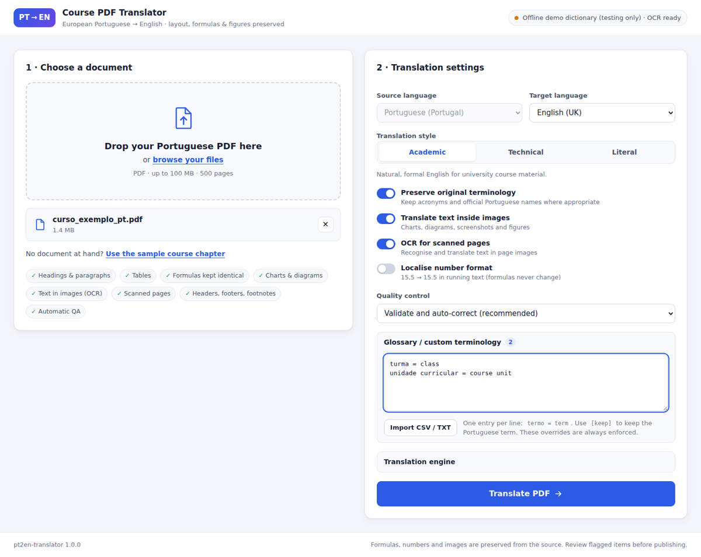
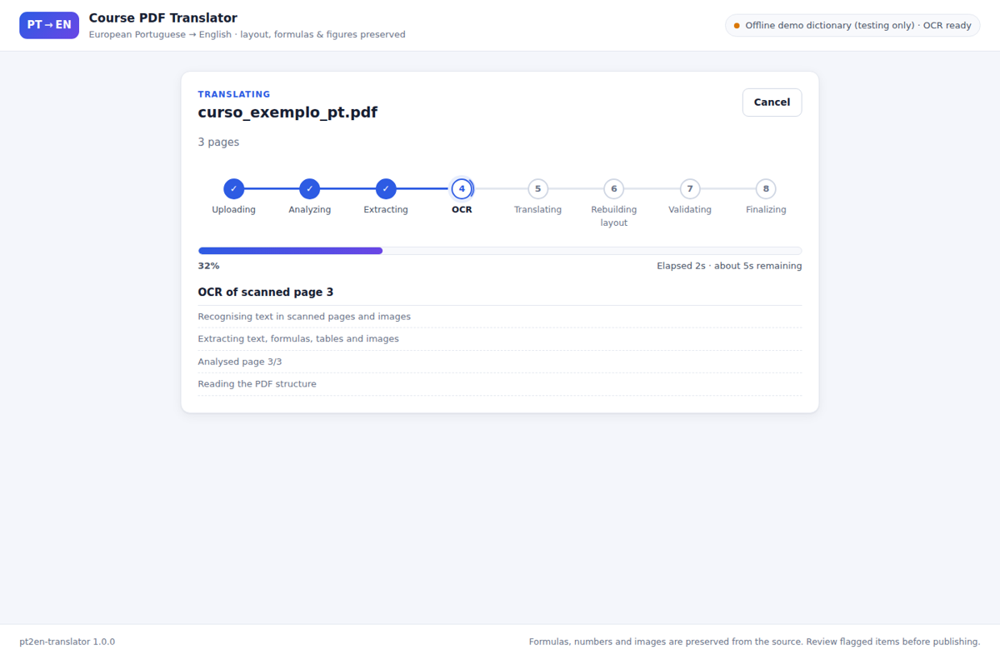
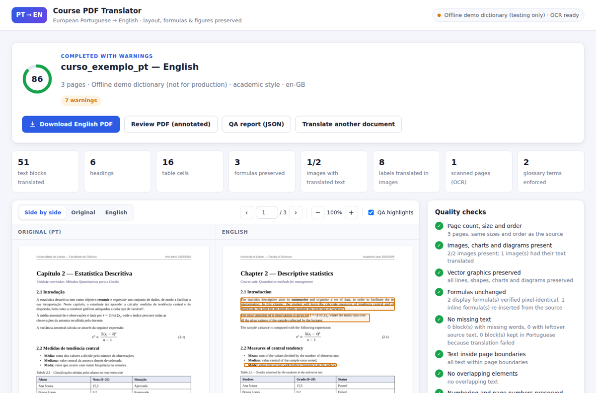

# PT→EN Course PDF Translator

Translate course material written in **European Portuguese (pt-PT)** into **English** while keeping the
original PDF's look: page size, margins, fonts, headings, tables, formulas, charts, diagrams, images,
headers/footers and page numbers stay where they were — only the language changes.



The application treats the PDF as a structured document. It does **not** extract the text and
typeset a new plain PDF: it removes the Portuguese glyphs in place, re-typesets the English text inside
the same frames, edits the text pixels of charts and scans, and copies every formula verbatim from the
source. A quality-control pass then checks the result and lists everything that needs a human eye.

| Portuguese source | English output |
| --- | --- |
| Text, headings, lists, captions, footnotes | Translated, same fonts/styles/positions (bold, italic, underline, colour kept) |
| Tables | Cell text translated inside the same cells; borders and shading untouched |
| Formulas and equations | **Identical** (display formulas are never touched; inline formulas are copied as vector clips of the source) |
| Numbers, units, variables | Unchanged (optional localisation of decimal commas in prose only) |
| Vector charts and diagrams | Labels translated in place (including rotated axis titles); shapes, lines and data untouched |
| Raster charts, screenshots, figures | Text found by OCR is erased from the pixels and redrawn in English (size, colour, weight, anchoring matched); everything else in the image is untouched |
| Scanned pages | OCR → translation → cleaned scan as background + searchable English text on top |
| Headers, footers, page numbers | Translated ("Página 3 de 10" → "Page 3 of 10") |

## Contents

- [Quick start](#quick-start)
- [Using the web application](#using-the-web-application)
- [Command line](#command-line)
- [How it works](#how-it-works)
- [Translation engines and terminology](#translation-engines-and-terminology)
- [Quality control](#quality-control)
- [Configuration](#configuration)
- [REST API](#rest-api)
- [Sample and test workflow](#sample-and-test-workflow)
- [Extending the application](#extending-the-application)
- [Limitations](#limitations)
- [Troubleshooting](#troubleshooting)

## Quick start

### Docker (recommended)

```bash
cd pt2en-translator
cp .env.example .env          # then set ANTHROPIC_API_KEY=...
docker compose up --build
# open http://localhost:8000
```

The image contains Tesseract OCR with Portuguese data and the metric-compatible fonts the layout
engine prefers (Carlito ≈ Calibri, Caladea ≈ Cambria, Liberation ≈ Arial/Times/Courier).

### Local installation

Requirements: Python 3.10–3.13, Tesseract OCR with the Portuguese language pack, and (recommended)
the fonts above.

```bash
# Debian / Ubuntu
sudo apt-get install tesseract-ocr tesseract-ocr-por fonts-liberation \
     fonts-crosextra-carlito fonts-crosextra-caladea fonts-dejavu-core
# macOS
brew install tesseract tesseract-lang

cd pt2en-translator
python -m venv .venv && source .venv/bin/activate
pip install -e .              # add [openai], [deepl], [argos] or [layout] for optional engines
cp .env.example .env          # set ANTHROPIC_API_KEY
pt2en doctor                  # checks OCR, fonts and provider configuration
pt2en serve                   # http://localhost:8000
```

Without an API key you can still try everything with the **offline demo translator**
(`PT2EN_TRANSLATOR=demo`, or pick it in the UI): it uses a small dictionary, produces rough English,
and exists to exercise the pipeline and the QA reports — not for real documents.

## Using the web application

1. **Choose a document** — drag and drop a PDF (or browse). *Use the sample course chapter* loads a
   generated Portuguese test document. Upload progress is shown while the file is sent.
2. **Translation settings**
   - Source *Portuguese (Portugal)* → target *English (UK)* or *English (US)*.
   - Style: **Academic** (natural formal English), **Technical** (field terminology, concise) or
     **Literal** (faithful to the source structure).
   - *Preserve original terminology* keeps acronyms and official Portuguese names where appropriate.
   - *Translate text inside images*, *OCR for scanned pages*, *Localise number format*.
   - *Quality control*: validate and auto-correct (default), report only, or structural checks only.
   - *Glossary / custom terminology*: one `termo = term` per line (CSV/TSV/JSON import supported);
     `termo = [keep]` keeps the Portuguese term. These overrides are always enforced.
3. **Processing** — a live stepper shows *Uploading → Analyzing → Extracting → OCR → Translating →
   Rebuilding layout → Validating → Finalizing*, the current operation, elapsed time and an estimate of
   the time remaining. Jobs can be cancelled, and reloading the page resumes following the job.

   

4. **Result** — quality score and status, per-check results, the list of items to review, the
   terminology used, and a viewer with *Side by side* (synchronised scrolling), *Original* and
   *English* modes, zoom, page navigation and QA highlights drawn on the pages. Clicking an item
   jumps to it. Downloads: **English PDF**, **review PDF** (same PDF with an annotated summary page and
   a coloured box + comment on every finding) and the **QA report** (JSON).

   

## Command line

```bash
pt2en translate curso.pdf -o course.pdf \
      --style technical --variant en-US --glossary termos.txt \
      --review course-review.pdf --report course.qa.json
pt2en serve --port 8000          # web application
pt2en sample curso_exemplo.pdf   # generate the Portuguese sample document
pt2en doctor                     # environment check
```

`pt2en translate --help` lists every option (`--provider`, `--no-images`, `--no-ocr`,
`--localize-numbers`, `--no-preserve-terms`, `--qa fix|report|off`, …).

## How it works

```
             ┌──────────────┐   ┌──────────┐   ┌─────────────────────────┐
 PDF ──────▶ │  Ingestion   │──▶│ Parsing  │──▶│ Layout & classification │
             │ validate,    │   │ glyphs,  │   │ paragraphs, headings,   │
             │ decrypt,     │   │ styles,  │   │ lists, tables, formulas,│
             │ normalise    │   │ images,  │   │ labels, headers/footers │
             └──────────────┘   │ drawings │   └────────────┬────────────┘
                                └──────────┘                │
        ┌──────────────────────────────┬────────────────────┤
        ▼                              ▼                    ▼
 ┌─────────────┐               ┌──────────────┐     ┌────────────────┐
 │ OCR: scans, │               │ Translation  │◀────│ Terminology    │
 │ image text, │──────────────▶│ batching,    │     │ base + doc +   │
 │ ligatures   │               │ validation,  │     │ user glossary  │
 └─────────────┘               │ retries, TM  │     └────────────────┘
                               └──────┬───────┘
                                      ▼
 ┌──────────────────────────────────────────────────────────┐   ┌──────────────┐
 │ Reconstruction: glyph-level redaction, re-typesetting,    │──▶│ Validation & │──▶ English PDF
 │ formula clips, image pixel edits, scanned-page rebuild    │   │ repair loop  │    review PDF
 └──────────────────────────────────────────────────────────┘   └──────────────┘    QA report
```

| Stage | Module | What happens |
| --- | --- | --- |
| Ingestion | `pt2en/ingestion` | Checks the file is a PDF, decrypts (empty password), repairs, enforces limits, bakes page rotation into the content so every stage shares one coordinate system. |
| Parsing | `pt2en/parsing` | Per-glyph text extraction with font, size, colour, bold/italic/underline, baseline; synthetic spaces and tab-stop splitting; image placements, vector drawings, figure clusters, table cells. Unmapped ligature glyphs (`�`, common with Calibri's "ti") are recovered by OCR'ing the word. |
| Layout & classification | `pt2en/layout` | Lines → paragraphs (column, spacing, style and list-marker aware); per-page routing (native text vs scanned); classification into heading, paragraph, list item, caption, footnote, table cell, figure label, header, footer, page number, formula; alignment, indents, line pitch and the free space each block may grow into. Optional DocLayout-YOLO hints. |
| Mathematics | `pt2en/layout/math.py` | Every glyph is classified text/math from its font (CMMI, Cambria Math, Symbol…), Unicode class and context (operands of operators, decorated variables `x̄ xᵢ`, function names). Lines that are mathematics only are *display formulas* and are never modified. Inline formulas become placeholders `<m1/>` with their exact geometry (fraction bars and overlines included). |
| OCR | `pt2en/ocr`, `pt2en/visual` | Tesseract (`por+eng`). Scanned pages get a second, denoised/binarised attempt when confidence is low. Images are OCR'd horizontally and rotated ±90° (vertical axis titles); legend swatches and icons are filtered out. |
| Translation | `pt2en/translation` | Blocks are serialised with inline markup (`<b> <i> <u> <sup> <sub> <sN>`, formula and URL placeholders), de-duplicated, looked up in the translation memory, batched with section context and the previous paragraph, and translated concurrently. Each result is validated (markup, formulas, numbers, mandatory terms, leftover Portuguese) and retried with targeted feedback. Anything that still fails keeps the original text and is reported. |
| Reconstruction | `pt2en/reconstruction` | Precise redactions remove only the Portuguese glyphs (images, vector art, formulas and untouched text stay byte-identical); the English is typeset in the block's frame with the original font when it has the needed glyphs, otherwise a metric-compatible family; alignment, indentation, line spacing and first baseline are preserved; text that does not fit uses free space below, then tighter leading, then a smaller size. Inline formulas are pasted back as vector clips of the source page. |
| Visual translation | `pt2en/visual` | Text pixels are erased (flat backgrounds filled, textured ones in-painted), English labels are drawn with matched size, colour, weight and anchoring (legend entries stay left-aligned next to their swatch, centred labels stay centred) and the image object is rewritten in place. Scanned pages are rebuilt from the cleaned scan plus live text. |
| Validation | `pt2en/validation` | See [Quality control](#quality-control). |

## Translation engines and terminology

| Provider | Setting | Notes |
| --- | --- | --- |
| **Claude (Anthropic)** — default | `PT2EN_TRANSLATOR=anthropic`, `ANTHROPIC_API_KEY` | Model `claude-opus-5-5` by default (`PT2EN_ANTHROPIC_MODEL`), effort `high`. Uses structured JSON output, a prompt-cached system prompt (style guide + full glossary), automatic terminology extraction and an accuracy review pass. Server-side refusal fallbacks are enabled (`PT2EN_ANTHROPIC_FALLBACKS=none` to disable). |
| OpenAI-compatible | `openai`, `OPENAI_API_KEY`, `PT2EN_OPENAI_BASE_URL`, `PT2EN_OPENAI_MODEL` | Any chat-completions endpoint (OpenAI, Azure, OpenRouter, vLLM, Ollama…). `pip install -e ".[openai]"`. |
| DeepL | `deepl`, `DEEPL_API_KEY` | XML tag handling keeps markup and formulas; mandatory terms are sent as a DeepL glossary. `pip install -e ".[deepl]"`. |
| Argos Translate | `argos` | Fully offline neural MT (downloads the pt→en model once). Inline styles are not preserved. `pip install -e ".[argos]"`. |
| Demo | `demo` | Offline dictionary for testing only. |

**Terminology layer.** Three glossaries are merged, later ones overriding earlier ones:

1. a curated **European-Portuguese base glossary** (`translation/base_glossary.py`): Portuguese
   higher-education terms (*unidade curricular*, *frequência*, *época de recurso*…), PT-PT vs PT-BR
   false friends (*facto*, *equipa*, *ecrã*, *ficheiro*, *registo*…), and mathematics, statistics,
   computing, accounting and engineering terms (*sucessão*, *contradomínio*, *existências*, *betão*…);
2. a **document glossary** extracted automatically (frequent multi-word terms, headings and bold
   terms → the LLM proposes the standard English term) — enforced;
3. **user overrides** from the UI/CLI — always enforced.

Every translation is checked against the mandatory terms; violations are retried with feedback and
reported if they persist. Identical source segments are translated once (consistent headers,
repeated labels) and a persistent translation memory reuses previous translations made with the same
settings.

## Quality control

Before the PDF is written the validator re-opens it and checks:

| Check | How |
| --- | --- |
| Page count, size and order | Page-by-page comparison and image-placement fingerprints. |
| Images, charts, diagrams | Every source image placement must still exist. |
| Vector graphics | Drawing counts per page (lines, shapes, chart marks). |
| Formulas | Display formulas are rasterised in source and output and compared pixel by pixel; every inline formula placeholder must be present. |
| Missing text | The words of each translation must be extractable from the area where it was placed; length ratios flag omissions/additions; leftover source glyphs are detected. |
| Page boundaries / overlaps | Placed text must stay on the page and not overlap other elements. |
| Numbering | Section numbers, list enumerators, captions and page numbers keep their numbers. |
| Terminology | Mandatory glossary terms are used everywhere. |
| **Second pass: untranslated Portuguese** | The output text layer is scanned line by line for Portuguese, and every image region and scanned page of the output is OCR'd again. |
| Accuracy review (LLM providers) | A reviewer prompt checks meaning, omissions, additions and terminology; with *auto-correct*, major findings are fixed. |

Blocks that still contain Portuguese are re-translated with feedback and the document is rebuilt
once more (`PT2EN_QA_MAX_REPAIR_ROUNDS`). Nothing is silently corrupted: text that cannot be
translated or rendered reliably keeps the original and becomes an *error* item with its location;
image text that OCR cannot read confidently is left untouched and reported; scanned formulas stay as
pixels. The report contains a 0–100 score, the status (*passed*, *passed with warnings*,
*needs review*), statistics, the glossary and per-stage timings.

## Configuration

All settings are environment variables (or `.env`); see [`.env.example`](.env.example) for the full
list. The most important ones:

| Variable | Default | Purpose |
| --- | --- | --- |
| `PT2EN_TRANSLATOR` | `anthropic` | Default provider (`anthropic`, `openai`, `deepl`, `argos`, `demo`). |
| `ANTHROPIC_API_KEY` | – | Claude API key. |
| `PT2EN_ANTHROPIC_MODEL` / `PT2EN_ANTHROPIC_EFFORT` | `claude-opus-5-5` / `high` | Model and effort level. |
| `PT2EN_STYLE` / `PT2EN_ENGLISH_VARIANT` | `academic` / `en-GB` | Defaults for new jobs. |
| `PT2EN_OCR_LANGUAGES` | `por+eng` | Tesseract languages. |
| `PT2EN_OCR_MIN_CONFIDENCE` | `55` | Below this, OCR text is not replaced but reported. |
| `PT2EN_MIN_FONT_SCALE` / `PT2EN_HARD_MIN_FONT_SCALE` | `0.72` / `0.5` | Font-size floor when English needs more room (beyond the first, a warning is raised). |
| `PT2EN_REUSE_ORIGINAL_FONTS` | `true` | Reuse embedded fonts when they contain all needed glyphs. |
| `PT2EN_QA_REVIEW` | `fix` | `fix`, `report` or `off`. |
| `PT2EN_DATA_DIR` | `./data` | Jobs, outputs and the translation memory. |
| `PT2EN_MAX_UPLOAD_MB` / `PT2EN_MAX_PAGES` | `100` / `500` | Upload limits. |
| `PT2EN_MAX_CONCURRENT_JOBS` / `PT2EN_JOB_TTL_HOURS` | `2` / `72` | Worker pool size and retention of finished jobs. |
| `PT2EN_ACCESS_TOKEN` | – | Optional shared secret (`Authorization: Bearer …` or `?token=`). |

## REST API

| Method & path | Description |
| --- | --- |
| `GET /api/health` | Liveness. |
| `GET /api/config` | Providers (and whether they are configured), OCR status, limits and defaults. |
| `POST /api/jobs` | Multipart upload: `file` (PDF) + `options` (JSON with any of `provider`, `style`, `english_variant`, `preserve_terminology`, `localize_numbers`, `translate_images`, `ocr_enabled`, `qa_review`, `glossary_text`). Returns the job. |
| `GET /api/jobs/{id}` | Job status, progress (stage, %, ETA, message) and summary. |
| `GET /api/jobs/{id}/events` | Server-sent events with live progress. |
| `POST /api/jobs/{id}/cancel` · `DELETE /api/jobs/{id}` | Cancel / delete. |
| `GET /api/jobs/{id}/report` | QA report (JSON). |
| `GET /api/jobs/{id}/download/{translated\|review\|original\|report}` | Files. |
| `GET /api/jobs/{id}/pages` · `GET /api/jobs/{id}/pages/{n}.png?doc=original\|translated&scale=1.5` | Page sizes and rendered previews. |
| `GET /api/sample` | The Portuguese sample document. |

Interactive documentation is available at `/docs`.

## Sample and test workflow

```bash
pt2en sample curso_exemplo_pt.pdf
PT2EN_TRANSLATOR=demo pt2en translate curso_exemplo_pt.pdf -o course-en.pdf --review review.pdf
pip install -e ".[dev]" && pytest -q
```

The sample chapter covers headings with section numbers, styled paragraphs, bullet lists, an inline
formula with an overline, a display formula with a fraction bar and equation number, a ruled table,
a raster bar chart (with a rotated axis title and a legend), a vector flowchart, a vector line chart
with a rotated axis title, a footnote, running headers/footers with page numbers and a noisy scanned
page. The test suite covers math detection, markup round-trips, language detection, glossary
parsing/enforcement, typesetting, the translation engine's validation/retry logic, the Claude
provider's request contract (mocked), the full pipeline and the web API. CI runs it in
`.github/workflows/pt2en-translator.yml`.

## Extending the application

Each stage sits behind a small interface, so engines can be swapped without touching the rest:

- **Translation provider** — subclass `pt2en.translation.base.Translator` (`translate_batch`, and
  optionally `extract_terminology` / `review`) and register it in `pt2en/translation/registry.py`.
- **OCR engine** — implement `pt2en.ocr.base.OCREngine` (`recognize`, `available`) and return it from
  `create_ocr` in `pt2en/ocr/tesseract.py`.
- **Layout detector** — implement `pt2en.layout.detector.LayoutDetector`; a DocLayout-YOLO ONNX
  detector is included (`PT2EN_LAYOUT_DETECTOR=doclayout`, `pip install -e ".[layout]"`).
- **PDF library** — PyMuPDF is confined to ingestion, parsing, reconstruction, image I/O and
  validation; the document model (`pt2en/model`) is library-independent.

## Limitations

- English is usually shorter than Portuguese, but when a translation needs more room the font is
  reduced (down to 72 % by default, 50 % at most) and flagged; very dense pages may need manual
  touch-ups.
- Text in raster images is redrawn with a standard sans/serif family matched for size, weight and
  colour, not the exact original typeface. Text on photographs or strong gradients is in-painted and
  may leave faint traces. Image text OCR'd with low confidence is reported, not replaced.
- Scanned pages are rebuilt with a serif (or sans) family; italics in scans are not detected. Rotated
  (sideways) scans are reported instead of translated.
- Text drawn as vector outlines (no font) is detected by the QA pass but not replaced.
- Right-to-left scripts, vertical writing and form fields are out of scope.

## Troubleshooting

| Symptom | Fix |
| --- | --- |
| "OCR unavailable" in the header | Install Tesseract and `tesseract-ocr-por`; check with `pt2en doctor`. |
| "The translation provider … is not configured" | Set `ANTHROPIC_API_KEY` (or another provider's key) in `.env` and restart. |
| Requests rejected mentioning *fallback* | Set `PT2EN_ANTHROPIC_FALLBACKS=none` (gateway without beta support). |
| Fonts look different from the original | Install `fonts-crosextra-carlito`/`caladea` and `fonts-liberation`, or point `PT2EN_FONT_DIRS` at the original fonts. |
| Many "untranslated Portuguese" items | Check the provider (the demo dictionary is intentionally incomplete) and the glossary `[keep]` entries. |

## License

AGPL-3.0, like the repository it lives in.
